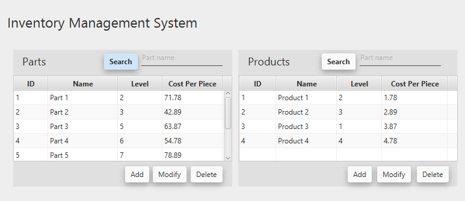
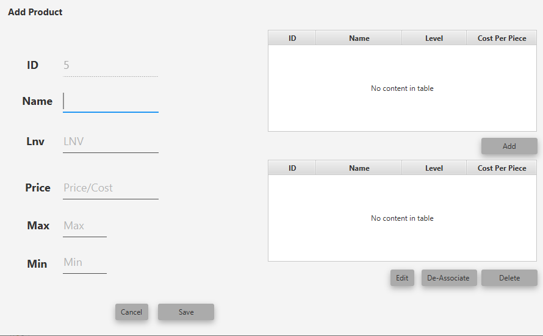

<head>
    <meta name='keywords' content='fxml, java, json, openweather'>
</head>

## Inventory Management Project - For basic purpose

The Inventory Management app demo built in using java in netbeans.

## License

This Project is open-sourced software licensed under the [MIT license](https://opensource.org/licenses/MIT).

## Demo Screenshots

